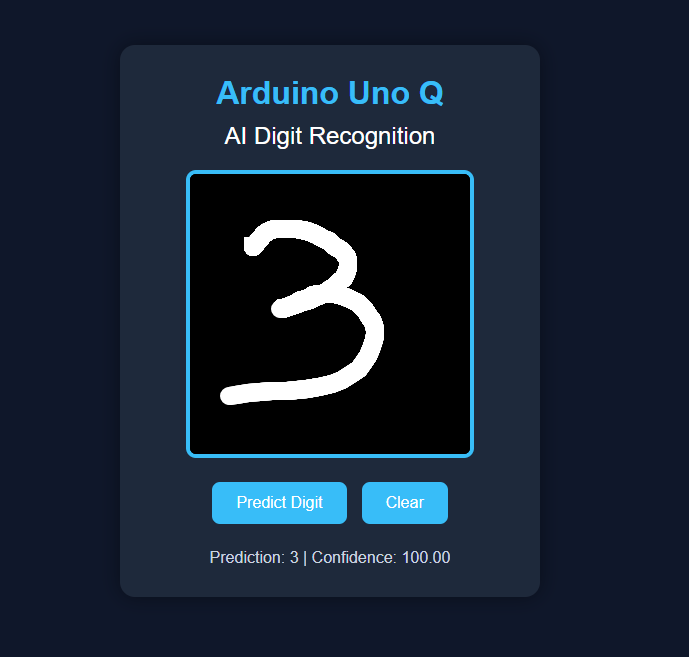
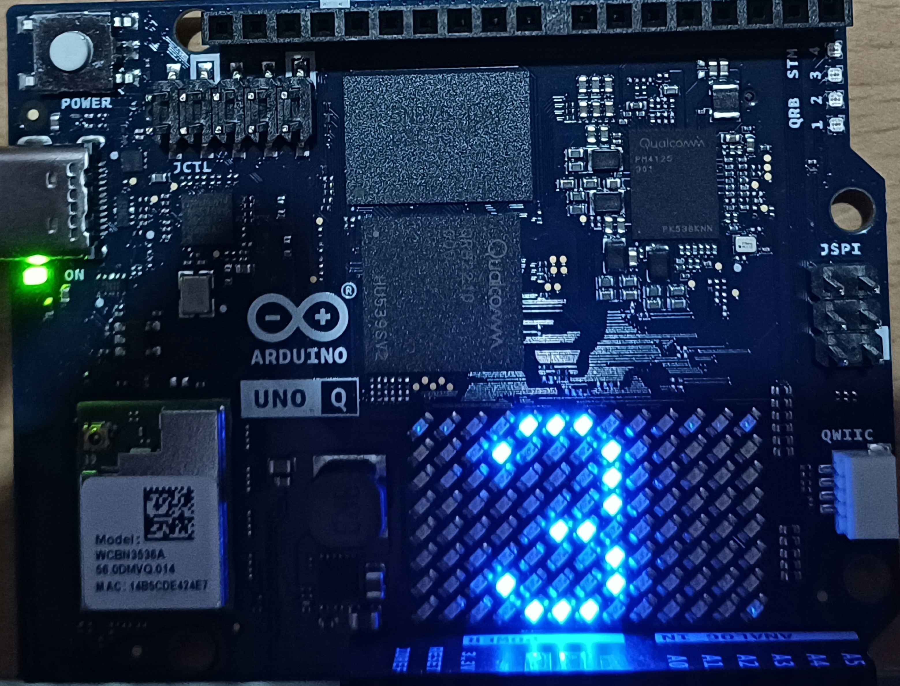

# Arduino Uno Q – AI Handwritten Digit Recognition

## Overview

This project demonstrates **AI-powered handwritten digit recognition** using the **Arduino Uno Q** and **Arduino App Lab**.

A user draws a handwritten digit (0–9) on a web-based canvas. The drawing is sent to an AI image classification model trained using the **MNIST dataset**. The predicted digit is displayed on the webpage and simultaneously sent to the Arduino Uno Q, where it is shown on the onboard LED matrix.

---

## ✨Features

- Draw handwritten digits (0–9) in a web browser
- AI-based digit recognition using a custom-trained model
- Real-time prediction display
- Communication between Web UI and Arduino through Router Bridge
- Display the recognized digit on the Arduino Uno Q LED Matrix

---

## Hardware Required

- Arduino Uno Q
- USB cable
- Computer

---

## Software Requirements

- Arduino App Lab
- Arduino Router Bridge
- Image Classification Brick
- Web UI Brick
- Google Chrome or Microsoft Edge
- Edge Impulse Studio Account

---

## 📸 Demo

### Web Interface


### LED Matrix Output

---

## 🏗️Project Structure

```text
.
├── assests
    ├──index.html               # Web interface
    ├── style.css               # Styling
    ├── app.js                  # Frontend logic
├── python
    ├──main.py                  # Python backend
├── sketch
    ├──digits.h                 # LED matrix digit bitmaps
    └── Arduino Sketch (.ino)   # Arduino program
```

---

# 🔄System Architecture

```text
                    +---------------------------+
                    |       Web Browser         |
                    |---------------------------|
                    | HTML + CSS + JavaScript   |
                    | Drawing Canvas            |
                    +------------+--------------+

                                 |
                                 | Web UI
                                 |
                                 v
                    +---------------------------+
                    |      Python Backend       |
                    |---------------------------|
                    | Image Classification      |
                    | AI Model Inference        |
                    | Router Bridge             |
                    +------------+--------------+

                                 |
                                 | Bridge.provide("get_digit")
                                 |
                                 v
                    +---------------------------+
                    |      Arduino Uno Q        |
                    |---------------------------|
                    | Arduino Sketch            |
                    | LED Matrix Display        |
                    +---------------------------+
```

---

## ⚙️How It Works

1. The user draws a handwritten digit on the web canvas.
2. The canvas image is converted into a PNG image.
3. The image is sent to the Python backend.
4. The Image Classification Brick predicts the digit.
5. The prediction is displayed on the webpage.
6. The predicted digit is shared with the Arduino using Router Bridge.
7. The Arduino Uno Q reads the prediction and displays it on the onboard LED matrix.

---

## 🔄 Communication Flow

```text
        User enters a digit
               │
               ▼
           index.html
               │
               ▼
            app.js
               │
               ▼
      predict_digit message
               │
               ▼
            main.py
               │
      AI Image Classification
               │
               ▼
      Stores current digit
               │
               ▼
   Bridge.provide ("get_digit")
               │
               ▼
           sketch.ino
               │
         Loads bitmap
               │
               ▼
    Arduino Uno Q LED Matrix
```
---

## 🧩 Components

| Component | Description |
|-----------|-------------|
| **index.html** | Provides the web interface containing the drawing canvas, control buttons, and status display. |
| **style.css** | Styles the web interface with a modern, responsive design. |
| **app.js** | Handles canvas drawing, user interactions, and communication with the Python backend through the Web UI. |
| **main.py** | Receives the drawn image, performs AI-based digit classification, sends prediction results to the webpage, and exposes the latest prediction to the Arduino using Router Bridge. |
| **Arduino Sketch (.ino)** | Retrieves the latest predicted digit from the Python backend and displays it on the Arduino Uno Q onboard LED matrix. |
| **digits.h** | Contains bitmap patterns for digits (0–9) and the default display used by the Arduino LED matrix. |
| **Web UI Brick** | Enables communication between the browser interface and the Python backend. |
| **Image Classification Brick** | Performs inference using the trained AI model. |
| **Router Bridge** | Facilitates communication between the Python backend and the Arduino Uno Q. |
| **Arduino Uno Q LED Matrix** | Displays the recognized handwritten digit on the onboard LED matrix. |
---

## 🛠️Technologies Used

- Arduino Uno Q
- Arduino App Lab
- Arduino Router Bridge
- Web UI Brick
- Image Classification Brick
- Edge Impulse Studio
- HTML
- CSS
- JavaScript
- Python

---

This project is licensed under the MIT License. See the [LICENSE](LICENSE) file for details.
